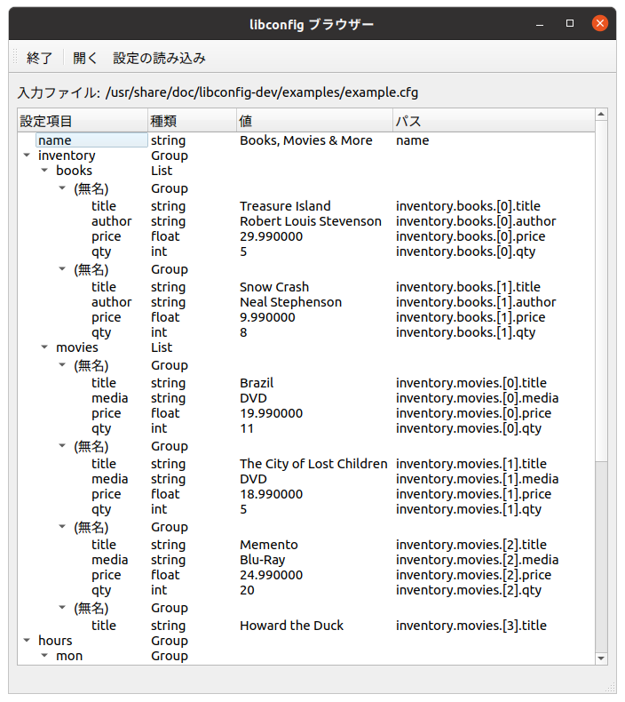

# libconfig Browser

GUI Browser for config files using the [libconfig++](http://www.hyperrealm.com/libconfig/) library.

This is a very simple program that displays all settings within a configuration file.
Besides displaying each setting, its type, value, and path are also shown.



Built using Qt5 under Ubuntu Linux (20.04)

## Requeriments

- libconfig++ (tested with version 1.5)
- Qt5 (tested with version 5.12.8)
 
## Building
QtCreator is not necessary to build.
Just run the `devtools/configure.sh` script from the project's root directory. A `build` directory will be created with a `Makefile`

```
devtools/configure.sh
cd build
make
```

Alternatively, import it into QtCreator.

## I18n

This program includes a basic support for UI internationalization. Japanese translation is included.

## License
GPLv3
